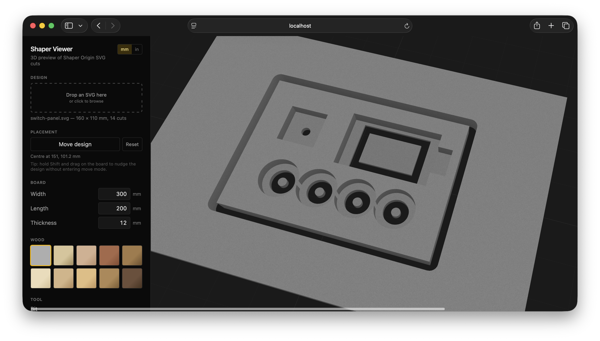

# Shaper Origin Viewer

A 3D preview tool for [Shaper Origin](https://www.shapertools.com/) SVG cut
files. Drop in a design, set your board dimensions and bit, and see exactly
what the cut will look like before you turn the router on.



Everything runs in your browser. **Your SVGs are never uploaded anywhere** —
the app loads them directly into the page and renders the preview locally.
You can verify this by using the app offline once it's loaded.

## Using the app

### 1. Load a design

Drop a Shaper Origin SVG onto the **Design** panel in the sidebar (or click
the panel to browse). The viewer accepts files exported from any tool that
follows the [Shaper Origin SVG
conventions](https://docs.shapertools.com/origin/svg-format) — Inkscape (with
the [Shaper extension](https://www.shapertools.com/en-us/learn/svg/inkscape)),
Fusion 360, Illustrator, and so on.

The parser recognises both modern and legacy encodings:

- The newer `shaper:cutType` attribute (`outside`, `inside`, `pocket`,
  `online`, `guide`, `anchor`).
- Older fill-and-stroke colour conventions used by Fusion / Inkscape exports
  (black-on-black for outside cuts, white-on-grey for online, and so on).

### 2. Configure the board

Type your physical board dimensions into the **Board** section: width,
length, and thickness. Numbers persist across sessions, so you only have to
set them once for a given stock.

Pick a wood species in the **Wood** swatch — MDF (the default) renders
plain grey; the rest are coloured procedurally with rings and grain that
follow onto the cut walls so you can read depth at a glance.

### 3. Pick a bit

The **Tool** dropdown lists every router bit Shaper sells. The default is the
6 mm flat up-spiral. Selecting a different bit changes the *global* default
applied to every cut that doesn't have its own diameter overridden in the
SVG.

If your bit isn't in the catalogue, choose "Custom diameter…" and enter your
own. Direction (up-cut / down-cut / compression) is omitted intentionally —
it doesn't affect the cut shape, only chip evacuation.

Note that *non-flat* profiles (v-bit, ball-nose, coving, fingerpull) are
shown as flat-bottomed kerfs at the nominal diameter for now. T-slot and
dovetail bits are excluded entirely because the renderer is 2.5D and can't
draw overhangs.

### 4. Per-cut bit overrides

The **Cuts** panel lists every cut in the design, with type, depth, and
current diameter.

- Hover or focus a row → the corresponding cut highlights amber on the board.
- Type a number into the diameter field → that one cut uses a custom bit.
  The amber border tells you it's been overridden.
- Click the `×` next to an overridden cut to revert it.
- Click the row label to **select** the cut. Shift-click for ranges,
  Cmd/Ctrl-click to toggle individual cuts.
- With cuts selected, picking a different bit from the **Tool** dropdown
  applies it to just those cuts. With nothing selected (or everything
  selected), the dropdown changes the global default.

### 5. Place the design

By default the design auto-centres on the board, or — if it has a Shaper
anchor (the red triangle) — that anchor lands at the board centre.

To override:

- Click **Move design** in the **Placement** section. The cursor turns into
  a crosshair; the board's top face becomes a click target. Click anywhere on
  the board to drop the design there.
- Or, hold **Shift** and drag on the board for live placement — the
  bounding-box outline tracks your cursor so you can see exactly where the
  design will land before releasing.
- Press **Esc** to cancel an in-progress placement.
- Hit **Reset** to revert to auto-centring.

### Other controls

| Action | Mouse |
|---|---|
| Orbit | Left-drag |
| Pan | Right-drag |
| Zoom | Scroll |

| Toggle | Where |
|---|---|
| mm / inches | Top-right of the sidebar |
| Cut volumes view | "Cut volumes" toggle in the sidebar — replaces the board with translucent extrusions of every cut, useful for sanity-checking exactly what the router will remove |

## Persistence

Everything you change — loaded SVG, board, bit, overrides, placement, units,
species — is saved to your browser's IndexedDB and restored on reload. To
start fresh, clear the site's storage in your browser's developer tools.

## Browser support

Anything modern: latest Chrome, Firefox, Safari, or Edge. The app uses
WebGL2 for rendering, IndexedDB for persistence, and a WASM build of the
[Clipper2](https://github.com/AngusJohnson/Clipper2) polygon library for
offsetting cut paths.

## What this isn't

- Not a CAM toolpath generator — it shows the *result* of a cut, not the
  movements the router will make.
- Not an SVG editor — it reads SVGs but can't modify them or save them back.
- Not a tolerance simulator — diameters and depths are taken at face value;
  no allowance for tool deflection, runout, or wood movement.

## Development

The viewer is a static SPA (Vite + TypeScript + React + Three.js). To run
locally:

```sh
pnpm install
pnpm dev      # development server with HMR
pnpm test     # vitest run-once
pnpm build    # production bundle into dist/
```

## Licence

[GPL-3.0](LICENSE).
